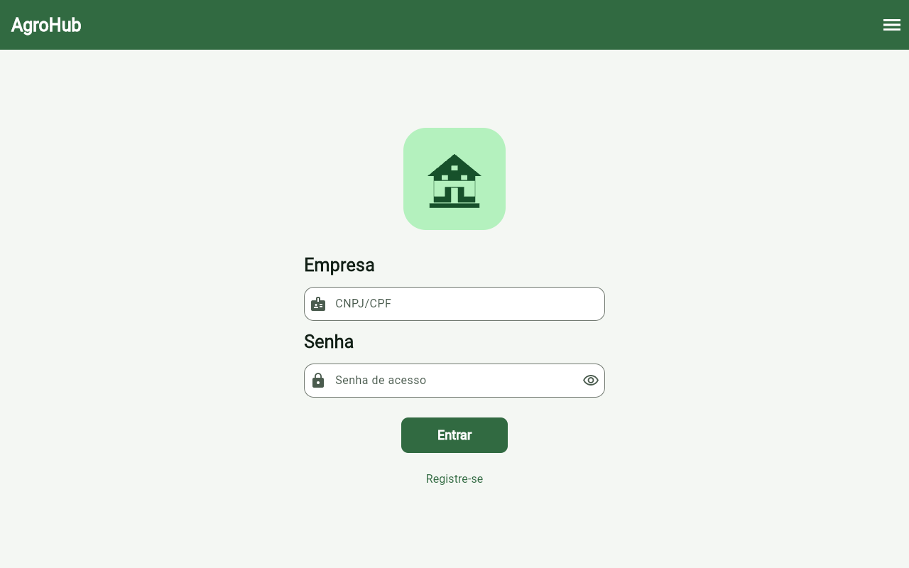

# AgroHub

Aplicativo Flutter para a gestão local de fazendas e comércios agrícolas. O catálogo mostra o estoque cadastrado, sem fluxo de compra. Todos os registros ficam no SQLite da instalação; não há backend, API, servidor, sincronização remota ou integração com serviços externos.



## Funcionalidades

- Acesso em etapas para empresa, administrador e operador, com separação por empresa e perfil.
- Cadastro e consulta de empresas, operadores, talhões e lotes, com pesquisa, filtros e paginação. A grade se adapta à largura da tela.
- Estoque com preço unitário, quantidade, validade opcional e destaque de produtos.
- Lançamentos de receitas e despesas, saldo, margem e indicadores do estoque.
- Tema claro, escuro ou automático, foto local e avatares por perfil.
- Alteração local de senha mediante sessão válida, senha atual e confirmação da nova senha.
- Exclusão local da empresa da sessão pelo administrador, com reautenticação e confirmação. A operação usa uma transação SQLite e preserva registros de outras empresas.

Se um lote legado apontar simultaneamente para operadores ou talhões de empresas diferentes, a exclusão é bloqueada antes de qualquer remoção para que o vínculo seja corrigido.

## Estrutura

- `lib/pages` e `lib/components`: telas, navegação e interação.
- `lib/view_models`: estado, validação e coordenação das ações.
- `lib/models` e `lib/entity`: registros tipados.
- `lib/repositories`: contratos de conta e implementações locais, além das consultas dos demais domínios. `AccountRepository` permite substituir o armazenamento dos fluxos revisados futuramente.
- `lib/services`: regras de sessão, autenticação local, aparência e ações de conta.
- `lib/database`: esquema SQLite, migrações e dados de demonstração.
- `test`: verificações de comportamento e regressão.

As consultas do estoque filtram por empresa e fazem as junções, a contagem e a paginação no SQLite. A migração para a versão 6 acrescenta índices para esses relacionamentos sem descartar os dados existentes. Os antigos módulos HTTP sem chamadas no aplicativo foram removidos.

## Executar

Na pasta `agrohub_app`:

```bash
flutter pub get
flutter run
```

Para abrir no navegador:

```bash
flutter run -d chrome
```

O suporte web usa `web/sqlite3.wasm` e `web/sqflite_sw.js`. Após atualizar a dependência SQLite web, esses arquivos podem ser regenerados com `dart run sqflite_common_ffi_web:setup`.

## Contas fictícias de demonstração

Uma instalação vazia recebe uma fazenda, um comércio, 20 operadores, 24 talhões, 20 lotes e cinco lançamentos financeiros ilustrativos. Estas credenciais pertencem exclusivamente a **contas fictícias** criadas no dispositivo:

| Etapa | Documento | Senha |
| --- | --- | --- |
| Empresa (fazenda) | `11222333000181` | `Agro2026` |
| Empresa (comércio) | `22333444000181` | `Agro2026` |
| Operação da empresa | Mesmo documento da empresa | `Campo2026` |
| Administração da empresa | Mesmo documento da empresa | `Agro2026` |
| Operador ativo de exemplo (Bruno) | `12345000279` | `Operador02` |

Entre primeiro na empresa. Na etapa seguinte, escolha o perfil de operação ou administração. Alguns operadores do conjunto demonstrativo estão inativos e não podem entrar.

## Limitações da autenticação local

As senhas e sessões são armazenadas localmente. A verificação de status é refeita ao carregar a sessão: contas inativas, excluídas e operadores de empresas inativas ou excluídas perdem o acesso. Esse mecanismo organiza o protótipo, mas **não oferece a segurança de uma autenticação com servidor**; quem controla o dispositivo e o banco local pode alterar seus dados. As contas demonstrativas são públicas e não devem guardar dados reais sensíveis.

“Alterar senha” requer estar autenticado no perfil correspondente e conhecer a senha atual. **Recuperação de senha esquecida não está disponível** neste projeto local: não há envio de e-mail, código de verificação ou prova remota de identidade. A interface explica essa limitação.

## Verificação

```bash
flutter analyze
flutter test
flutter build web --release
```

Há uma captura real da tela de entrada em `docs/screenshots/login-empresa.png`, obtida da versão web compilada. Ainda faltam capturas do painel administrativo, do estoque, da alteração de senha e da confirmação de exclusão para completar a galeria do portfólio.
